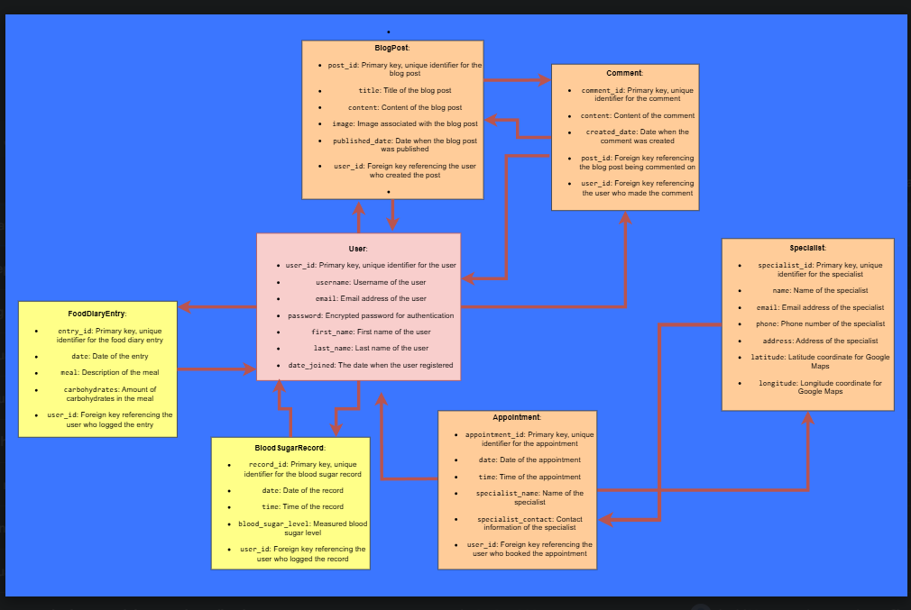
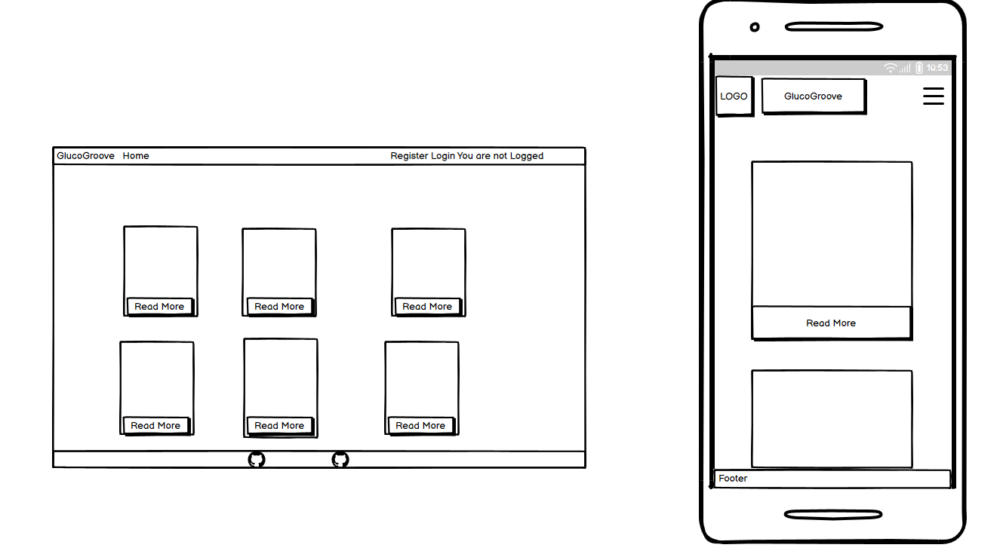
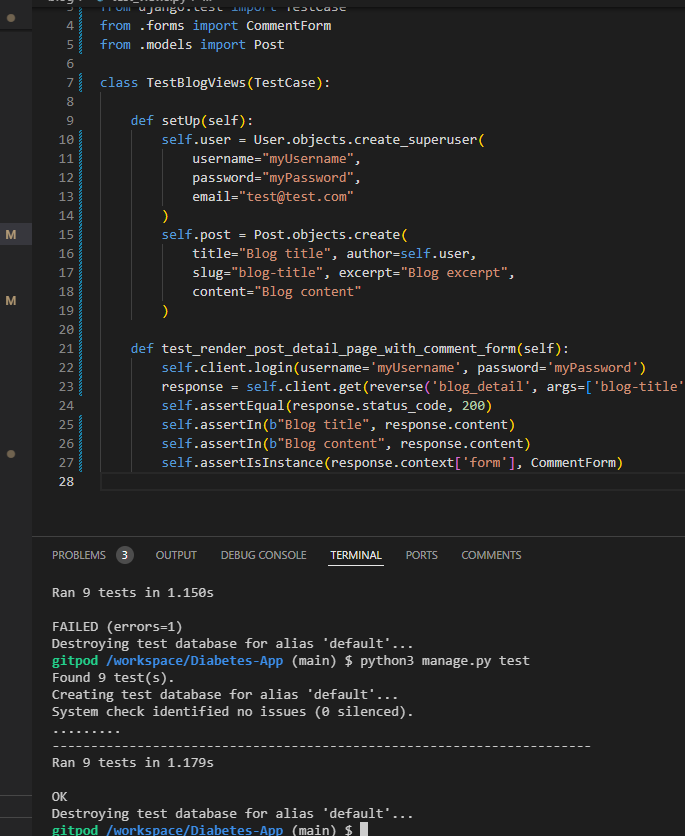
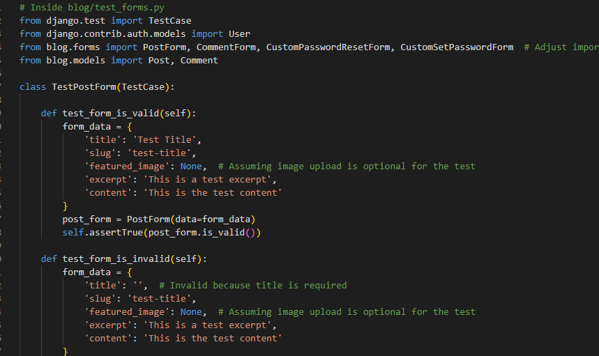

# **GlucoGroove**

## Overview

**GlucoGroove** is a Django-based online blog application that allows users to register, log in,
create new blog posts, leave comments, and interact with other users' posts.
The application is designed to provide a platform for sharing and
discussing experiences related to diabetes. The hope is to create an online community for those with diabetes
while giving the user a private space to record and track their blood sugars, food intake and
general record their daily lives in a safe space.

## Database Schema - Entity Relationship Diagram (ERD)

The ERD for GlucoGroove illustrates the realtionship between a user and how they can communicate effectively through blogs
and comments on blogs. It also identifies a logged in users ability to Edit or delete posts created by them.

A logged in user can maintain a food diary, daily diary and track their blood sugars which is displayed as a graph with
color indicators for high/low blood sugars.

The ERD includes elements for appointment booking with a specialist which will not been included in the current iteration
but could be added in future developments.

## UX - User Experience

### Colour Scheme

The color scheme was selected based on those used by current foundations, charities and organisations
that strive to improve the lives of those living with diabetes.

    - primary-blue: #005b96; /* Accessible blue */
    - secondary-red: #e63946; /* Soft red for emphasis */
    - neutral-grey: #f5f5f5; /* Light grey for backgrounds */
    - accent-gold: #c5a880; /* Muted sand gold for accents */
    - text-dark: #2d2d2d; /* Dark grey for primary text */
    - text-light: #ffffff; /* White for light text */

### Fonts

***Roboto*** and ***Lato** have been used to provide a clean and modern look to the web application.

### Agile Methodologies - Project Management

I used an agile approach to project management. The GlucoGroove development process was broken into sprints, and tasks were added to the GitHub project board to be tracked and managed through issues.

**Link to Project Board:** https://github.com/users/Gambit1583/projects/6
- This can also be accessed by clicking the second Github Icon in the apps footer.

### MoSCoW Prioritisation

- **Must-Haves:** User registration and login, ability to create and delete a blog, Blood sugar tracker. Edit feature for blog posts.
- **Should-Haves:** Comment and reply functions for blogs. Food diary and a daily diary.
- **Could-Haves:** Api for link to FreeStyle Libre blood glucose monitoring.
- **Won't-Haves:** Specialists or appointment bookings applications (at this stage). Payment system for private consultations. Google maps API.

## User Stories

- As a user I want to be able to login securely to access and update a blood sugar tracker.
- As a user I want to be able to manually reset my password should I forget it.
- As a user I want to be able to write a blog.
- As a user I want to be able to edit/delete my blog.
- As a user I want to be able to comment on other users posts.
- As a user I want to be able to keep a food diary and a daily diary.
- As a user I want to be able to upload an image to my blog.
- As a user I want to be able to view my blood sugar inputs on a graph.
- As admin I want to be able to update users in the admin admin panel.
- As admin I want to be able to edit or delete posts or comments

## Wireframes

### Home View

## Login View

## Registration View

## Logged in View

## Blood Sugar Tracker View

## Features

- User registration and authentication
- Create, edit, and delete blog posts
- Leave comments on blog posts
- Reply to comments and reply to replies
- Track blood sugars
- View a graph illustrating blood sugar level input by user
- Keep a food diary
- Keep a daily diary
- Responsive design for mobile and desktop

## Installation

### Prerequisites

- Python 3.6+
- Django

## Future Features

- Upvote and downvote comments and blogs
- Appointments booking
- Specialists near you with google maps api for location
- Login with google/facebook account

## Technologies & Languages Used

- Django - SQLite (default database)
- HTML5 - Markup language for structuring the website
- CSS3 - Styling language for designing the layout and visual aesthetics
- JavaScript - For interactivity and DOM manipulation on the frontend
- Python (Django) - Backend web framework for server-side logic and management
- PostgreSQL - Database management system for storing data
- Cloudinary - Cloud-based image storage solution
- Whitenoise - For serving static files directly from Django

## Libraries & Frameworks

- **Django** - Backend framework
- **Django Crispy Forms** - For elegant form rendering
- **Cloudinary** - Media storage
- **Whitenoise** - For serving static files

## Tools & Programs

- **GitHub Projects** - Project management and tracking
- **Heroku** - Deployment and hosting
- **Balsamiq** - Wireframes and design prototypes

## **Testing**

### Automated Testing

### **Validation Testing**

**All code has been validated through:**

- **HTML**: [W3C Markup Validator](https://validator.w3.org/).
- **CSS**: [W3C CSS Validator](https://jigsaw.w3.org/css-validator/).
- **Python**: PEP8 validation to ensure code quality.
- **JavaScript** JShint

### **User Testing**

- **Browser Compatibility**: The website has been tested on Chrome and Edge.
- **Responsiveness** The platform has been tested on mobile, tablet, and desktop devices to ensure optimal performance.
- **Tested access** - with both existing and newly created users to ensure they can access their account.
- **Tested registration** and the automatic login on first use following registration.
- **Tested Graph Functionality** - Tested graph functionality to show blood sugar inputs over various time frames. graph plaots and connects as a line graph.
                                  Each plot when hovered over shows a color to indicate high/low/good and presents the user with the date and time that of
                                  the blood sugar result as input by the user.

- **Tested user upload** When creating a blog a user is able to upload their own image providing individulism and personal style to a blog.
                         Other users are ablt to comment on an individuals blog.

## Bugs, debugging and fixes or action

- Attribute error indicating Comment model does not have a title
  when trying to access Comments in admin panel.

    - There is a __str__ method trying to reference a title fixed by updating
      statement in Comments model.

- Debug set to FALSE application would not launch through Heroku giving a server error 500.

  - Identified that compressed storage STATICFILES_STORAGE prevent the page loading so commented out.
    this prevented the server 500 error but the default image for blog posts would not load.

  - Image was trying to load from a media file rather than the static folder.
    Identified that a management command was over-writing the featured_image field.
    Commented out management command and STATICFILES_STORAGE which has fixed the error.

  - Further issues in relation to static file storage were causing lack of responsiveness in Heroku
    after starting a second application in my project. After running similar fixes to the previous ones
    the issue was not resolved.
    This was eventually fixed by rewriting my entire settings.py and including the installation of
    Cloudinary within my project.

- Link to reset passwrd function directing to django admin panel.
  - Identified an incorrect link (using dev tools) in the html which was not pointing to the correct form.
  - restructured views and corrected link in html so that the user is directed to the correct password reset form.

## Deployment

All of the code for this project was written in Gitpod for the development environment.
- Github was used for version control.
- The application was deployed to Heroku from Github.

**Link to github Repository:** https://github.com/Gambit1583/Diabetes-App
- This can also be accessed by clicking the first Github icon in the apps footer.

### Pre-Deployment

To ensure a successful deployment to **Heroku:**

- **requirements.txt** essential that this is kept up to date and in ensuring all imported modules are configured for Heroku.
- **Procfile** This configures the application as a gunicorn web app on Heroku.
- **Allowed Hosts** Ensure this is configured to include the Heroku app name and the localHost.
- **Environment Variables** Ensure these are added to Heroku manually within the config vars and that your .env File is updated accordingly and added to the gitignore file.

### Deploying with Heroku

The steps for deploying to Heroku are as follows (Experience from previous Django projects):

1. **Create New App:** Log in to your Heroku account and click on the "Create New App" button.
2. **App Name:** Choose a unique name for your app.
3. **Select Region:** Choose the appropriate region (Europe was selected for this project).
4. **Create App:** Click the "Create App" button to proceed.
5. **Deployment Method:** In the "Deploy" tab, select GitHub as the deployment method.
6. **Connect to GitHub:** Search for the repository name and click "Connect".
7. **Manual or Automatic Deployment:** Select either manual or automatic deployment. Ensure the main branch is selected for deployment.
8. **Config Vars:** In the "Settings" tab, click "Reveal Config Vars" and input the required environment variables.
9. **Deploy:** Once the configuration is complete, click the "Deploy Branch" button. After successful deployment, a "View" button will appear to take you to the live site.

**The live link to Heroku for this project can be found here:** https://glucogroove-6bdf28427bc6.herokuapp.com/

## Credits

### Code
- John Rearden for his fantastic support as a coding coach.
- Kevin Loughrey for his 1-1 support
- Stack Overflow
- W3 Schools particurlary for CSS and bootstrap.
- Chat gpt for debugging snippets and recommendations on structure/formatting

### Media
- Favicon.io: For Favicon generation.
- Font Awesome

### Acknowledgements

- My two sons JJ and Ben who both live with Type 1 Diabetes and are my inspiration for this project.
- WECA cohort for help and advice at a time where we all had
  the pressure of our capstone project.

